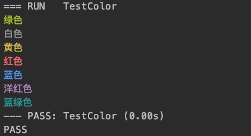
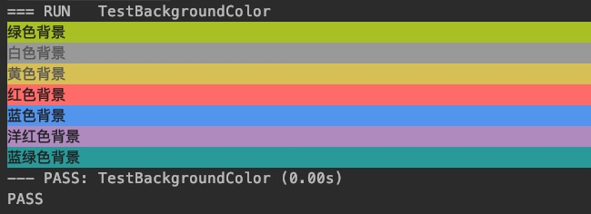

# golang 命令行输出带颜色的字符串
> 让你的命令行丰富多彩,输出不同颜色,自由组合

# 基本色
```
Green("绿色")
White("白色")
Yellow("黄色")
Red("红色")
Blue("蓝色")
Magenta("洋红色")
Cyan("蓝绿色")
```



# 背景色

```
GreenBG("绿色背景")
WhiteBG("白色背景")
YellowBG("黄色背景")
RedBG("红色背景")
BlueBG("蓝色背景")
MagentaBG("洋红色背景")
CyanBG("蓝绿色背景")
```



# 组合色

```
BlueBG(SRed("红字蓝底色"))
CyanBG(SYellow("黄字蓝绿底色"))
MagentaBG(SRed("红字洋底色"))
GreenBG(SMagentaBG("洋红字绿底"))
```

